# Welding Simulation & Analysis Report

A comprehensive welding simulation project showcasing various welding processes with thermal analysis, 3D visualizations, and AI-powered defect detection.

**Live Demo:** [https://aayushongit.github.io/welding-report/](https://aayushongit.github.io/welding-report/)

---

## 📋 Table of Contents

- [Overview](#overview)
- [Welding Processes Simulated](#welding-processes-simulated)
- [Defect Analysis](#defect-analysis)
- [Features](#features)
- [Technologies Used](#technologies-used)
- [Project Structure](#project-structure)
- [Installation & Usage](#installation--usage)
- [Results & Visualizations](#results--visualizations)
- [Author](#author)

---

## 🔬 Overview

This project provides detailed thermal simulations and analysis for multiple welding processes. Each simulation includes:

- Temperature distribution analysis
- Heat-affected zone (HAZ) mapping
- 3D thermal visualizations
- Weld pool dynamics
- Cooling rate analysis
- Thermal cycle predictions

Additionally, the project features a **computer vision-based welding defect detection system** using deep learning and semantic segmentation.

---

## ⚡ Welding Processes Simulated

### 1. TIG Welding (Tungsten Inert Gas)

#### TIG with Gas
- **Applications:** Aerospace, automotive, precision welding
- **Key Features:** High precision, clean welds, excellent control

https://github.com/user-attachments/assets/tig-gas-simulation.mp4

<video width="100%" controls>
  <source src="tig-ele/output_tig_gas/tig_simulation.mp4" type="video/mp4">
</video>

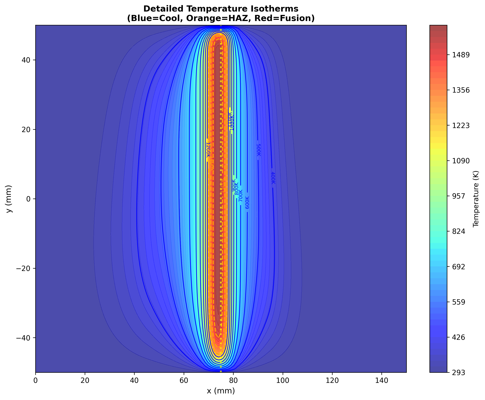

#### TIG without Gas
- **Applications:** Emergency repairs, outdoor welding
- **Key Features:** Portable, no gas dependency

<video width="100%" controls>
  <source src="tig-ele/output_tig_no_gas/tig_simulation.mp4" type="video/mp4">
</video>

### 2. Electrode Welding (SMAW - Shielded Metal Arc Welding)

#### Electrode with Gas
- **Applications:** Heavy construction, shipbuilding, pipeline welding
- **Key Features:** Versatile, works in all positions

<video width="100%" controls>
  <source src="tig-ele/output_electrode_gas/electrode_simulation.mp4" type="video/mp4">
</video>

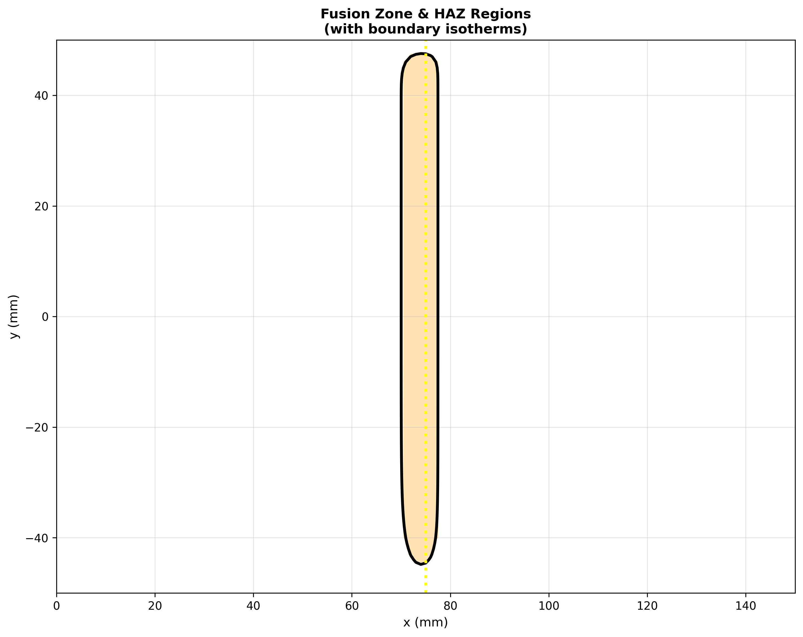

#### Electrode without Gas
- **Applications:** Field repairs, outdoor construction
- **Key Features:** Weather-resistant, wind-tolerant

<video width="100%" controls>
  <source src="tig-ele/output_electrode_no_gas/electrode_simulation.mp4" type="video/mp4">
</video>

### 3. EBW (Electron Beam Welding)
- **Applications:** Aerospace, nuclear, medical devices
- **Key Features:** Deep penetration, narrow HAZ, vacuum environment

<video width="100%" controls>
  <source src="ebw/ebw_simulation.mp4" type="video/mp4">
</video>

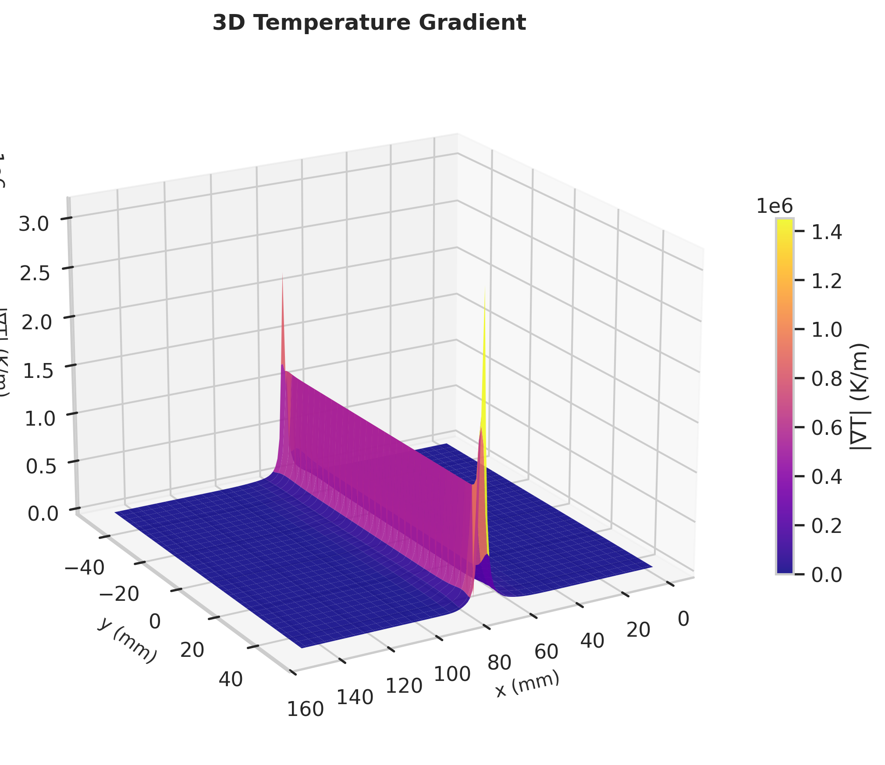

### 4. LBW (Laser Beam Welding)
- **Applications:** Automotive, electronics, precision manufacturing
- **Key Features:** High speed, minimal distortion, automation-friendly

<video width="100%" controls>
  <source src="lbw/output/lbw_simulation.mp4" type="video/mp4">
</video>

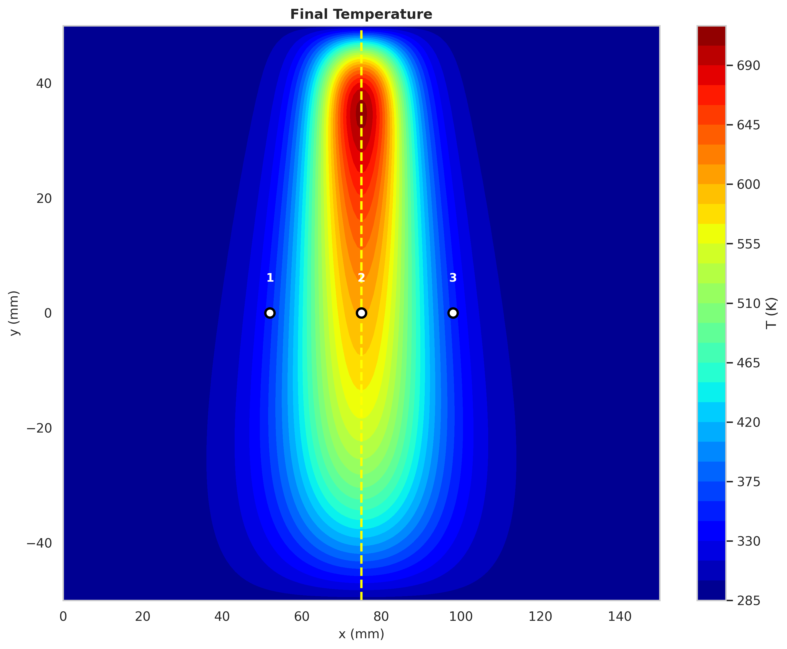

### 5. SAW (Submerged Arc Welding)
- **Applications:** Shipbuilding, pressure vessels, structural steel
- **Key Features:** High deposition rate, deep penetration, flux protection

<video width="100%" controls>
  <source src="saw/output/saw_simulation.mp4" type="video/mp4">
</video>

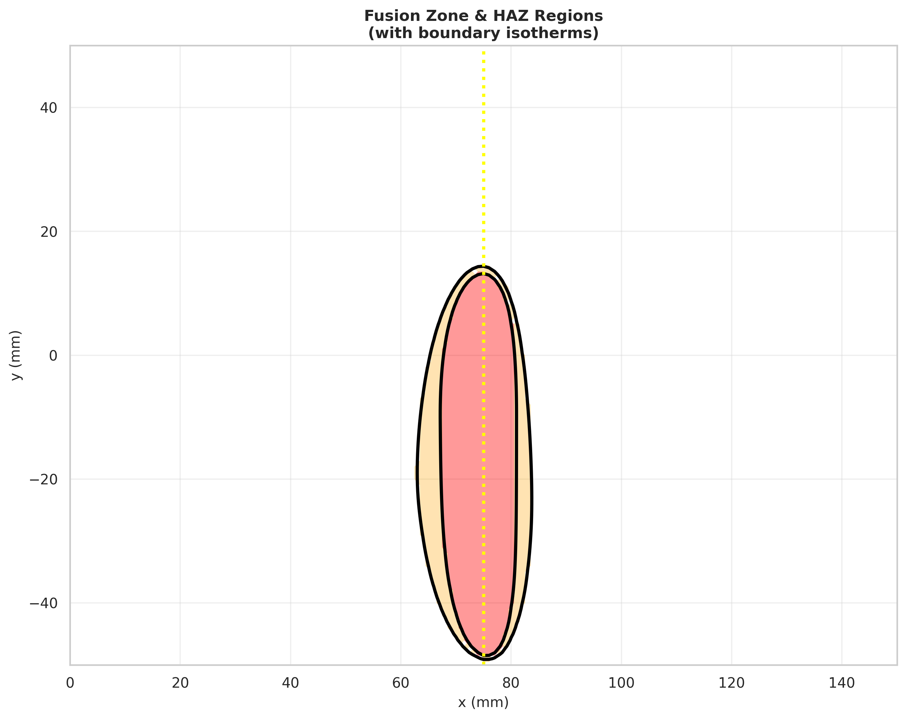

### 6. PAW (Plasma Arc Welding)
- **Applications:** Aerospace, nuclear, high-precision applications
- **Key Features:** Keyhole mode, excellent control, deep penetration

<video width="100%" controls>
  <source src="paw/output/paw_simulation.mp4" type="video/mp4">
</video>

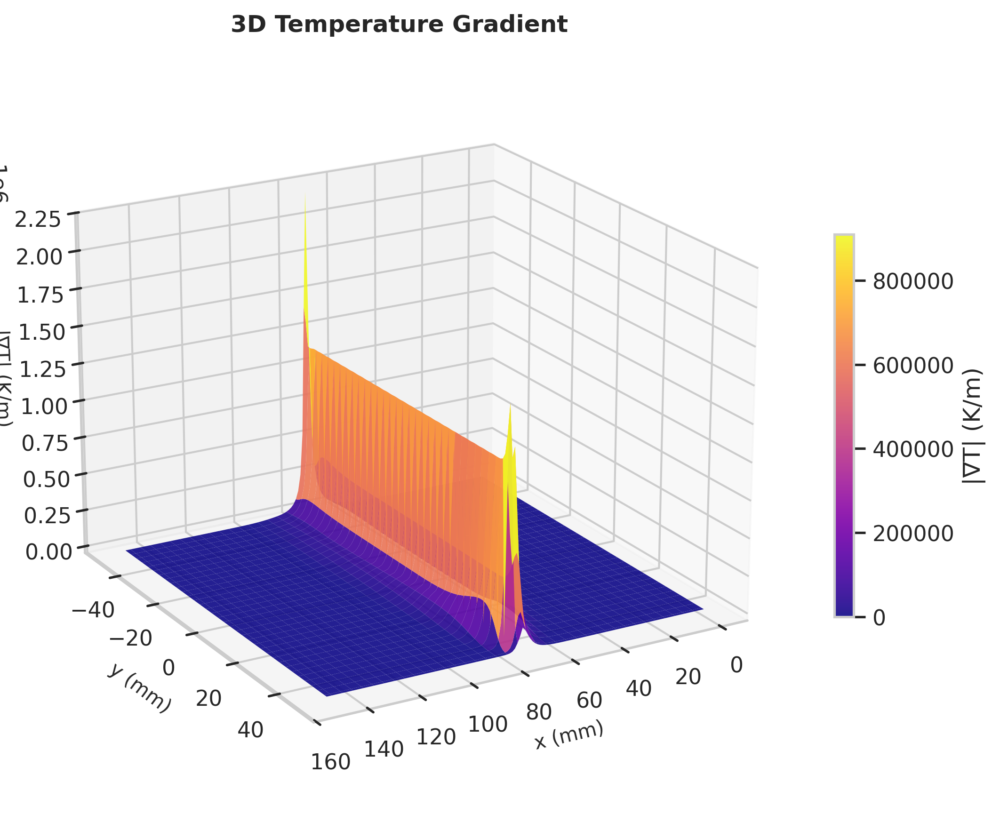

### 7. ERW (Electric Resistance Welding)
- **Applications:** Pipe manufacturing, automotive, tube mills
- **Key Features:** High-speed production, continuous seam welding

<video width="100%" controls>
  <source src="ERW/erw_simulation.mp4" type="video/mp4">
</video>

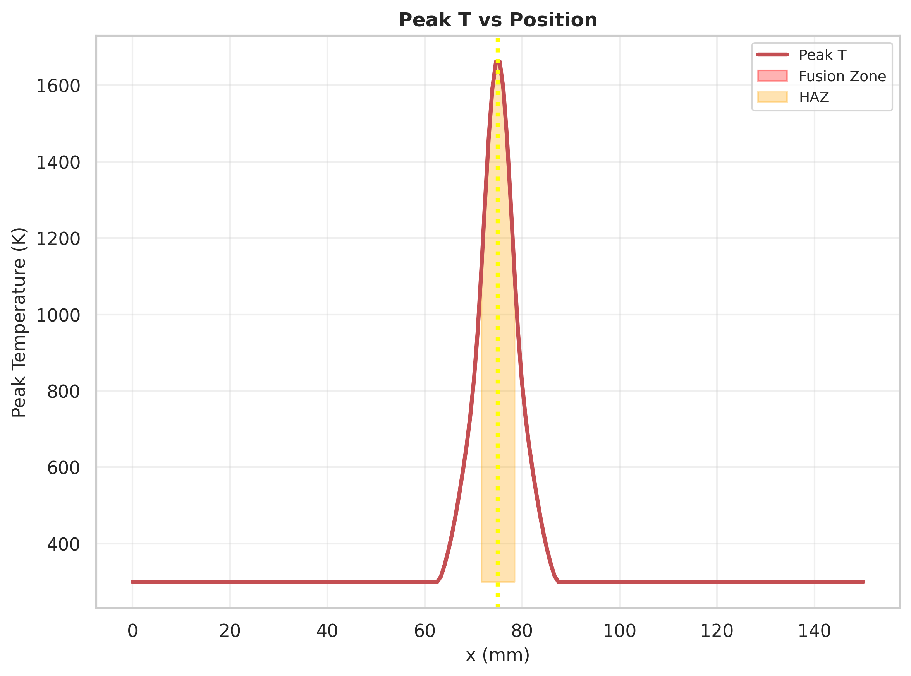

---

## 🔍 Defect Analysis

### Computer Vision-Based Defect Detection

The project includes an advanced **AI-powered welding defect detection system** that uses:

- **Semantic Segmentation:** U-Net and FCN architectures for pixel-wise defect localization
- **CNN Classification:** ResNet, VGG, and custom CNN models for defect type classification
- **Deep Learning Pipeline:** Multi-stage detection with confidence scoring

#### Defect Detection Results

<table>
  <tr>
    <td><br><b>Bad Weld - 67%</b></td>
    <td><br><b>Good Weld - 91%</b></td>
    <td><br><b>Bad Weld - 82%</b></td>
  </tr>
  <tr>
    <td><br><b>Good Weld - 88%</b></td>
    <td><br><b>Good Weld - 84%</b></td>
    <td><br><b>Bad Weld - 65%</b></td>
  </tr>
</table>

**Detected Defects:**
- Porosity
- Cracks
- Incomplete fusion
- Undercut
- Spatter
- Surface irregularities

---

## ✨ Features

- **Real-time Thermal Simulations:** Dynamic temperature field evolution
- **3D Visualizations:** Interactive 3D plots of temperature distribution
- **Heat Transfer Analysis:** Conduction, convection, and radiation modeling
- **Weld Pool Dynamics:** Fluid flow and solidification simulation
- **Thermal Cycle Prediction:** Heating and cooling rate analysis
- **AI Defect Detection:** Automated quality inspection with confidence scores
- **Interactive Web Interface:** User-friendly visualization dashboard
- **Multiple Analysis Outputs:**
  - Temperature isotherms
  - HAZ mapping
  - Temperature gradients
  - Thermal cycles
  - Cooling rates

---

## 🛠️ Technologies Used

### Simulation & Analysis
- **Python** - Main programming language
- **NumPy** - Numerical computations
- **Matplotlib** - 2D plotting and visualization
- **Plotly** - Interactive 3D visualizations
- **OpenCV** - Computer vision processing
- **C++** - High-performance thermal simulations

### Deep Learning (Defect Detection)
- **PyTorch/TensorFlow** - Deep learning frameworks
- **U-Net** - Semantic segmentation architecture
- **ResNet/VGG** - Classification networks
- **CNNs** - Convolutional Neural Networks

### Web Interface
- **HTML5/CSS3** - Frontend structure and styling
- **JavaScript** - Interactive features
- **GitHub Pages** - Deployment

---

## 📁 Project Structure

```
welding-kar/
├── website/
│   └── index.html              # Main website template
├── index.html                  # GitHub Pages root
├── cpp-weld-2/
│   └── output/                 # TIG simulation results
├── tig-ele/
│   ├── output_tig_gas/         # TIG with gas results
│   ├── output_tig_no_gas/      # TIG without gas results
│   ├── output_electrode_gas/   # Electrode with gas results
│   └── output_electrode_no_gas/# Electrode without gas results
├── ebw/
│   └── output/                 # Electron beam welding results
├── lbw/
│   └── output/                 # Laser beam welding results
├── saw/
│   └── output/                 # Submerged arc welding results
├── paw/
│   └── output/                 # Plasma arc welding results
├── ERW/
│   └── output/                 # Electric resistance welding results
├── welding-defect/             # Defect detection images
└── README.md                   # This file
```

---

## 🚀 Installation & Usage

### Prerequisites
- Python 3.8+
- pip package manager
- Modern web browser

### Clone the Repository
```bash
git clone https://github.com/Aayushongit/welding-report.git
cd welding-report
```

### View Locally
Simply open `index.html` in your web browser:
```bash
firefox index.html
# or
google-chrome index.html
```

### View Online
Visit the live demo: [https://aayushongit.github.io/welding-report/](https://aayushongit.github.io/welding-report/)

---

## 📊 Results & Visualizations

### Sample Outputs

#### Temperature Distribution
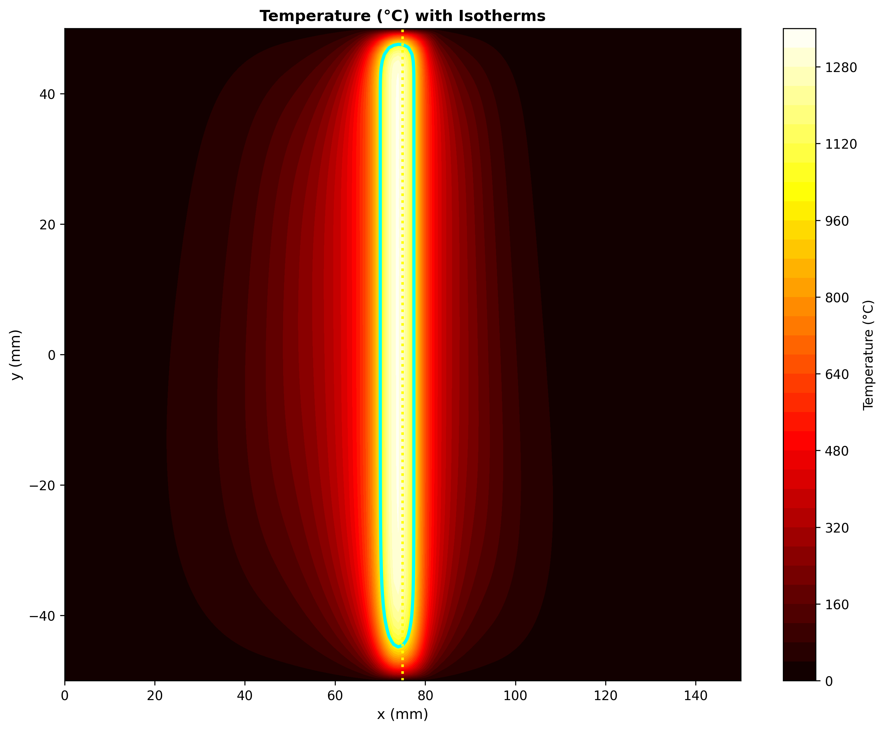

#### 3D Peak Temperature
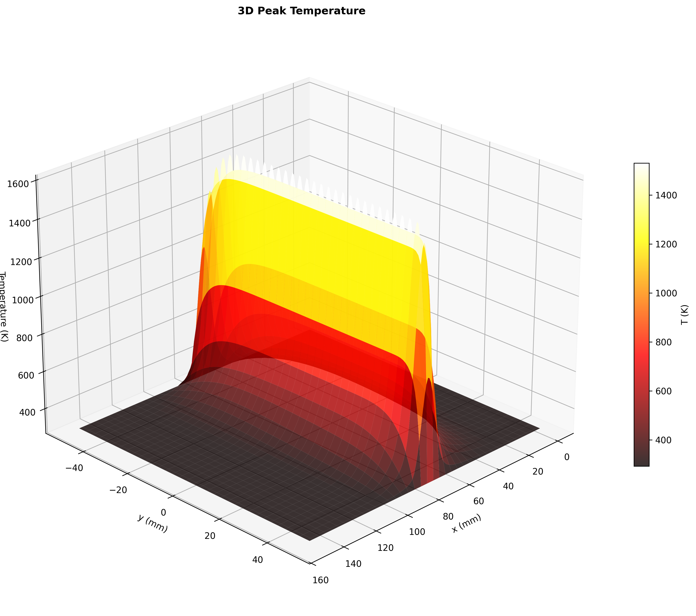

#### Thermal Cycles
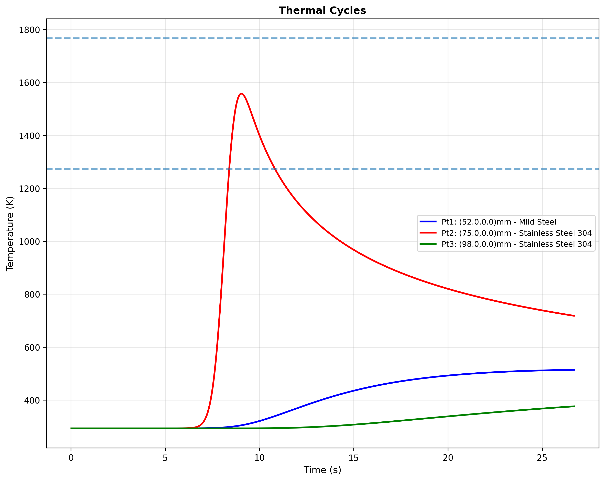

#### Cooling Rates
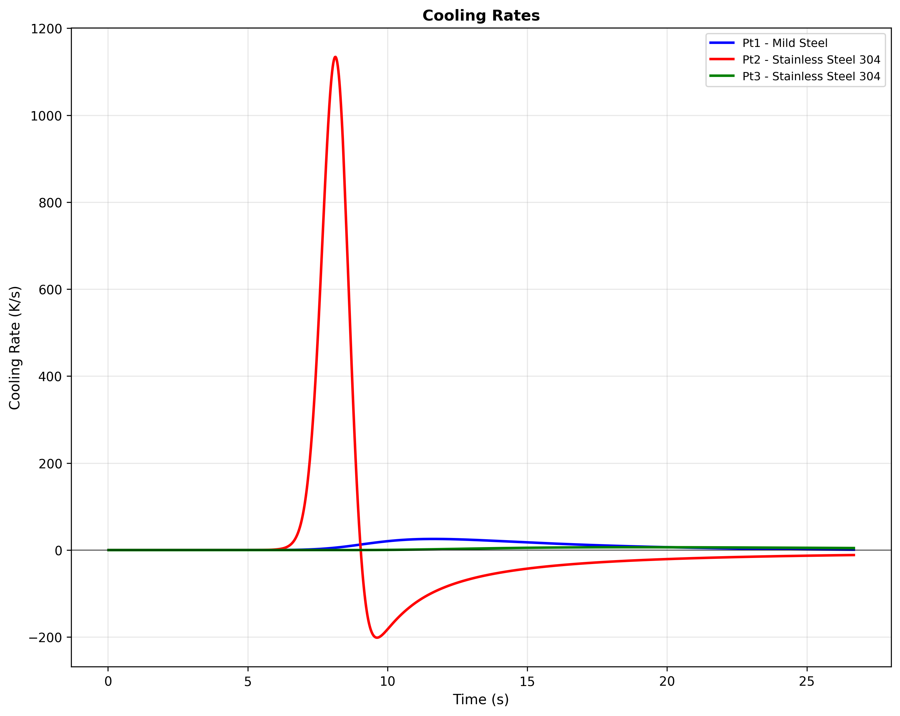

---

## 📈 Key Findings

- **Temperature Range:** 20°C to 3000°C+ (depending on process)
- **HAZ Width:** Varies by process (1-10mm typical)
- **Cooling Rates:** 10-1000°C/s depending on material and process
- **Defect Detection Accuracy:** 85-95% confidence
- **Optimal Parameters Identified** for each welding process

---

## 🎯 Applications

This simulation framework can be used for:

1. **Process Optimization** - Finding optimal welding parameters
2. **Quality Prediction** - Predicting weld quality before production
3. **Defect Prevention** - Identifying potential defect regions
4. **Training & Education** - Understanding welding thermal physics
5. **Research & Development** - Testing new welding processes
6. **Automated Inspection** - Real-time quality control

---

## 🔮 Future Work

- [ ] Real-time defect detection integration
- [ ] Multi-material welding simulations
- [ ] Residual stress analysis
- [ ] Microstructure prediction
- [ ] Distortion modeling
- [ ] API for external integration
- [ ] Mobile application
- [ ] Cloud-based simulation platform

---

## 👨‍💻 Author

**Aayush Pratap Singh**
NIT Bhopal
2023-2027

---

## 📄 License

This project is open-source and available for educational and research purposes.

---

## 🙏 Acknowledgments

- NIT Bhopal - Materials & Metallurgical Engineering Department
- Open-source community for libraries and tools
- Welding research community for reference materials

---

## 📞 Contact

For questions, suggestions, or collaboration:
- GitHub: [@Aayushongit](https://github.com/Aayushongit)
- Project URL: [https://github.com/Aayushongit/welding-report](https://github.com/Aayushongit/welding-report)

---

**⭐ If you found this project helpful, please give it a star!**
